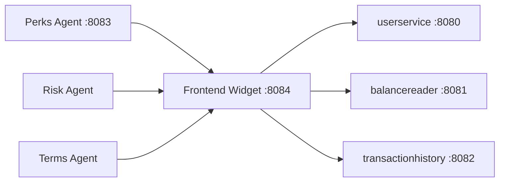

# Bank of Anthos - Port Forwarding Setup Guide

This guide helps you set up port-forwarding to enable the AI agents and frontend-widget to communicate with the Bank of Anthos backend services.

## 🎯 **Why Port Forwarding is Needed**

The Bank of Anthos AI agents (frontend-widget, perks-agent, etc.) need to access the core banking services running in Kubernetes. These services are only accessible within the cluster, so we use `kubectl port-forward` to create local tunnels.

## 📋 **Required Services**

The AI agents need access to these Bank of Anthos services:

| Service | Local Port | K8s Port | Purpose |
|---------|------------|----------|---------|
| `userservice` | 8080 | 8080 | User authentication & login |
| `balancereader` | 8081 | 8080 | Account balance retrieval |
| `transactionhistory` | 8082 | 8080 | Transaction data for AI analysis |

## 🚀 **Quick Setup Script**

Run this single script to set up all port forwards:

```bash
#!/bin/bash
# setup-port-forwards.sh

echo "Setting up port forwards for Bank of Anthos AI agents..."

# Kill any existing port forwards
echo "Cleaning up existing port forwards..."
pkill -f "kubectl.*port-forward.*userservice" 2>/dev/null || true
pkill -f "kubectl.*port-forward.*balancereader" 2>/dev/null || true
pkill -f "kubectl.*port-forward.*transactionhistory" 2>/dev/null || true

# Wait a moment for cleanup
sleep 2

# Set up new port forwards
echo "Starting port forwards..."
kubectl port-forward svc/userservice 8080:8080 &
kubectl port-forward svc/balancereader 8081:8080 &
kubectl port-forward svc/transactionhistory 8082:8080 &

# Wait for connections to establish
sleep 5

echo "✅ Port forwards established!"
echo ""
echo "Active port forwards:"
echo "  userservice:        http://localhost:8080"
echo "  balancereader:      http://localhost:8081" 
echo "  transactionhistory: http://localhost:8082"
echo ""
echo "You can now run the AI agents and frontend-widget!"
```

## 📝 **Manual Setup Commands**

If you prefer to run commands individually:

```bash
# 1. Clean up any existing port forwards
pkill -f "kubectl.*port-forward.*userservice" 2>/dev/null || true
pkill -f "kubectl.*port-forward.*balancereader" 2>/dev/null || true
pkill -f "kubectl.*port-forward.*transactionhistory" 2>/dev/null || true

# 2. Set up port forwards (run each in background)
kubectl port-forward svc/userservice 8080:8080 &
kubectl port-forward svc/balancereader 8081:8080 &
kubectl port-forward svc/transactionhistory 8082:8080 &

# 3. Verify connections (optional)
sleep 3
curl -s http://localhost:8080/ready || echo "userservice not ready"
curl -s http://localhost:8081/ready || echo "balancereader not ready"  
curl -s http://localhost:8082/ready || echo "transactionhistory not ready"
```

## 🔍 **Verification Steps**

### 1. Check if services exist in Kubernetes:
```bash
kubectl get svc | grep -E "(userservice|balancereader|transactionhistory)"
```

**Expected output:**
```
balancereader        ClusterIP   34.118.229.203   <none>   8080/TCP   8h
transactionhistory   ClusterIP   34.118.239.93    <none>   8080/TCP   8h  
userservice          ClusterIP   34.118.233.76    <none>   8080/TCP   8h
```

### 2. Check if port forwards are running:
```bash
ps aux | grep "kubectl.*port-forward" | grep -v grep
```

### 3. Test API connectivity:
```bash
# Test the frontend-widget API (requires port forwards)
curl -s "http://localhost:8084/api/real-preapproval?username=testuser" | jq '.transaction_count'
```

**Expected:** Should return a number > 0 (e.g., `100`)

## 🛠️ **Troubleshooting**

### **Problem: Port forwards not working**
```bash
# Check if ports are already in use
lsof -i :8080
lsof -i :8081  
lsof -i :8082

# Kill processes using these ports
sudo kill -9 $(lsof -t -i:8080) 2>/dev/null || true
sudo kill -9 $(lsof -t -i:8081) 2>/dev/null || true
sudo kill -9 $(lsof -t -i:8082) 2>/dev/null || true
```

### **Problem: Services not found in Kubernetes**
```bash
# Check if Bank of Anthos is running
kubectl get pods | grep -E "(userservice|balancereader|transactionhistory)"

# If pods are not running, deploy Bank of Anthos first:
kubectl apply -f kubernetes-manifests/
```

### **Problem: Connection refused errors**
```bash
# Check if pods are ready
kubectl get pods -l app=userservice
kubectl get pods -l app=balancereader  
kubectl get pods -l app=transactionhistory

# Check pod logs for errors
kubectl logs -l app=userservice --tail=20
kubectl logs -l app=balancereader --tail=20
kubectl logs -l app=transactionhistory --tail=20
```

### **Problem: Frontend-widget returns empty data**
1. **Check transaction data exists:**
   ```bash
   kubectl exec -it ledger-db-0 -- psql -U admin -d postgresdb -c \
     "SELECT COUNT(*) FROM transactions WHERE from_acct = '1011226111' OR to_acct = '1011226111';"
   ```

2. **Re-populate data if needed:**
   ```bash
   ./populate_data.sh
   ```

## 🔄 **Restart Procedure**

When you restart your machine or Kubernetes cluster:

1. **Check if Bank of Anthos is running:**
   ```bash
   kubectl get pods
   ```

2. **If pods are not running, redeploy:**
   ```bash
   kubectl apply -f kubernetes-manifests/
   ```

3. **Wait for pods to be ready:**
   ```bash
   kubectl wait --for=condition=ready pod -l app=userservice --timeout=300s
   kubectl wait --for=condition=ready pod -l app=balancereader --timeout=300s
   kubectl wait --for=condition=ready pod -l app=transactionhistory --timeout=300s
   ```

4. **Set up port forwards:**
   ```bash
   ./setup-port-forwards.sh  # or run manual commands above
   ```

5. **Verify AI agents work:**
   ```bash
   curl -s "http://localhost:8084/api/real-preapproval?username=testuser" | jq '.analysis.spending_categories | keys'
   ```

## 🎯 **What Each Service Does**

### **userservice (port 8080)**
- **Purpose:** User authentication and account management
- **Used by:** All AI agents for JWT token generation
- **Test endpoint:** `/login?username=testuser&password=bankofanthos`

### **balancereader (port 8081)**  
- **Purpose:** Real-time account balance retrieval
- **Used by:** Frontend-widget for current balance display
- **Test endpoint:** `/balances/{account_id}` (requires auth token)

### **transactionhistory (port 8082)**
- **Purpose:** Historical transaction data for AI analysis
- **Used by:** Frontend-widget for spending pattern analysis
- **Test endpoint:** `/transactions/{account_id}` (requires auth token)

## 📊 **AI Agent Dependencies**



## 🔧 **Advanced Configuration**

### **Custom Ports**
If you need to use different ports, update the `SERVICES` configuration in `enhanced-demo.py`:

```python
SERVICES = {
    'userservice': 'http://localhost:8080',        # Change port here
    'balancereader': 'http://localhost:8081',      # Change port here
    'transactionhistory': 'http://localhost:8082'  # Change port here
}
```

### **Remote Access**
To access from other machines on your network:

```bash
# Use 0.0.0.0 instead of 127.0.0.1
kubectl port-forward --address 0.0.0.0 svc/userservice 8080:8080 &
kubectl port-forward --address 0.0.0.0 svc/balancereader 8081:8080 &
kubectl port-forward --address 0.0.0.0 svc/transactionhistory 8082:8080 &
```

## 📞 **Quick Health Check**

Run this one-liner to check everything is working:

```bash
echo "Testing AI agent connectivity..." && \
curl -s "http://localhost:8084/api/real-preapproval?username=testuser" | \
jq -r 'if .transaction_count > 0 then "✅ All systems operational! Found \(.transaction_count) transactions with \(.analysis.spending_categories | keys | length) spending categories." else "❌ No transaction data found" end'
```

**Expected output:**
```
Testing AI agent connectivity...
✅ All systems operational! Found 100 transactions with 17 spending categories.
```

---

## 🚀 **Ready to Use!**

Once port forwarding is set up, you can:

1. **Visit the frontend widget:** http://localhost:8084
2. **Test spending analysis:** Click "Get My Personalized Offer"  
3. **View realistic data:** See coffee, grocery, and other spending categories
4. **Check AI insights:** Get personalized credit card recommendations

**Happy Banking!** 🏦✨
